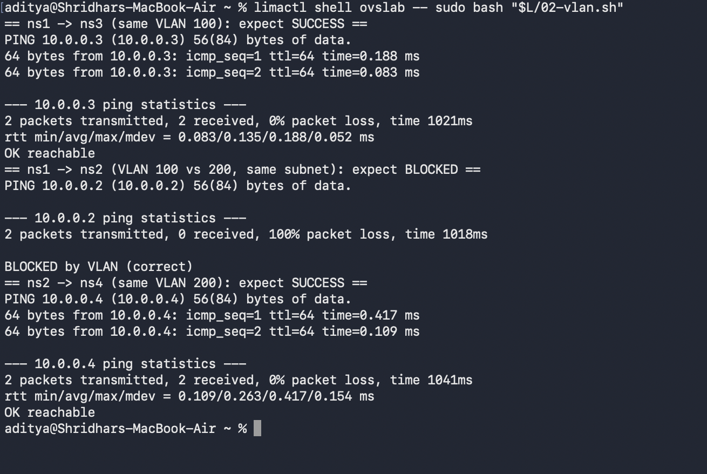
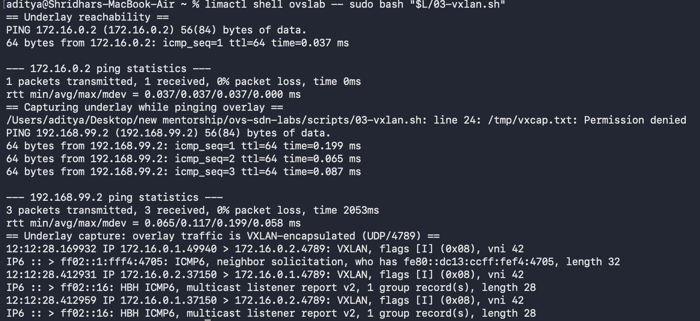
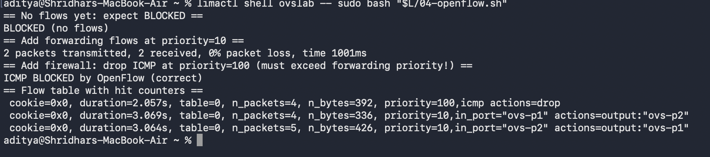
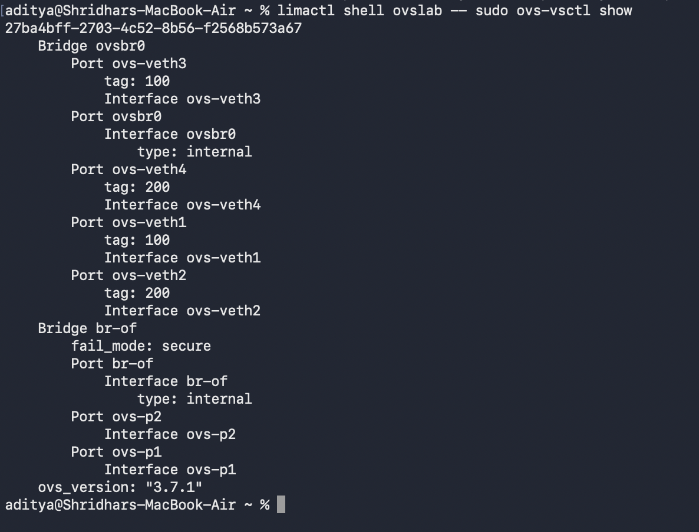

# OVS SDN Labs

I built these labs to teach myself how Open vSwitch and software-defined networking
actually work. I'm applying for the LFX mentorship "DPU-Accelerated OVS Offload" (OPI
project), and since I didn't have a deep networking background, I figured the best way
to learn was to build everything myself and break it until it made sense.

All of this runs on an Ubuntu VM on my Mac (M4, using Lima). Every output and
screenshot here is from my own machine.

Setup I used:
- Ubuntu 26.04, Open vSwitch 3.7.1, QEMU 10.2.1, libvirt 12.0.0
- I use Linux network namespaces as fake "hosts" and wire them into OVS with veth pairs.

The reason I picked these specific topics: the project is about offloading the OVS
datapath onto a DPU (like a BlueField card) so the CPU doesn't have to do the packet
forwarding. I figured I should first understand the software path before I can
understand what gets offloaded, so that's what these labs cover.

## Lab 1 - basic L2 switch

Two hosts on one OVS bridge, pinging each other.

```
ns1 (10.0.0.1) --veth--+
                       ovsbr0
ns2 (10.0.0.2) --veth--+
```

It worked: 4 packets, 0% loss, and the flow counter went up to n_packets=84. OVS also
learned both MAC addresses in its fdb table. Script: `scripts/01-l2-switch.sh`

## Lab 2 - VLANs

Added two more hosts and split all four into VLAN 100 and VLAN 200.

- ns1 -> ns3 (both VLAN 100): works
- ns1 -> ns2 (VLAN 100 vs 200, same subnet): blocked
- ns2 -> ns4 (both VLAN 200): works

The part I found cool is that ns1 and ns2 are on the same 10.0.0.0/24 subnet but still
can't talk, purely because of the VLAN tag. Script: `scripts/02-vlan.sh`



## Lab 3 - VXLAN overlay

Made two "servers" on an underlay network (172.16.0.0/24) and ran an overlay network
(192.168.99.0/24) on top using a VXLAN tunnel.

While pinging the overlay, I ran tcpdump on the underlay to check it was actually being
encapsulated:

```
172.16.0.1.49940 > 172.16.0.2.4789: VXLAN, flags [I], vni 42
172.16.0.2.37150 > 172.16.0.1.4789: VXLAN, flags [I], vni 42
```

So the ping is wrapped inside UDP port 4789. This is how clouds carry tenant traffic
over a shared physical network. Script: `scripts/03-vxlan.sh`



## Lab 4 - OpenFlow rules

Put a bridge in secure mode so it does nothing by default, then wrote OpenFlow rules by
hand to make traffic flow, then added a rule to drop ICMP like a firewall.

```
no flows                      -> ping blocked
add forwarding (priority 10)  -> ping works
add icmp drop (priority 100)  -> ping blocked again
```

This one took me a while. My first drop rule didn't work and I couldn't figure out why.
Turns out flows without a priority default to 32768, which was higher than my forwarding
rules, so the drop never matched. Once I set the forwarding rules to priority 10 it
worked. Script: `scripts/04-openflow.sh`



## Lab 5 - Kubernetes pod networking

Set up a small k3s cluster and deployed some pods to see how pod networking works.

```
client pod -> web pod 10.42.0.9   ok
client pod -> web pod 10.42.0.11  ok
Service (10.43.128.88) load-balances across both web pods
```

The thing that clicked for me: I checked the host interfaces and the CNI (Flannel) had
made a Linux bridge (cni0) and a VXLAN device (flannel.1):

```
flannel.1: vxlan id 1 local 192.168.5.15 dev eth0 dstport 8472
cni0:      10.42.0.1/24
```

So Kubernetes pod networking is basically the same stuff from labs 1 and 3 - pods on a
node share a bridge, and traffic between nodes goes over a VXLAN overlay. That connected
everything for me. Script: `scripts/05-k8s-pod-networking.sh`
(needs k3s: `curl -sfL https://get.k3s.io | sh -`)

## Lab 6 - OVN logical networks

This is the one closest to what the mentorship actually works on. OVN (Open Virtual
Network) is the SDN system that sits on top of OVS and is what OVN-Kubernetes uses under
the hood. Instead of configuring bridges directly, you describe the network you want -
logical switches, logical routers, logical ports - in a database, and OVN programs OVS to
make it real.

I set my machine up as an OVN chassis, then:

- Created a logical switch `ls1` with two ports and pinged across it. The switch only
  exists in the OVN database, but the traffic is real.
- Added a logical router `lr1` joining `ls1` (192.168.10.0/24) to a second logical switch
  `ls2` (192.168.20.0/24), and pinged a host on one subnet from the other.

```
vm1 (192.168.10.1) --ls1--+
                          lr1 (logical router)
vm3 (192.168.20.1) --ls2--+
```

The cross-subnet ping worked and came back with ttl=63 instead of 64, which proves it
actually went through the logical router and wasn't just on the same segment. The whole
topology is defined in OVN's database (`ovn-nbctl show`) and OVN handles turning it into
OVS flows. This is the same model OVN-Kubernetes uses to give pods networking across
nodes and subnets. Script: `scripts/06-ovn-logical-network.sh`
(needs OVN: `sudo apt-get install -y ovn-central ovn-host ovn-common`)

## A look at all the bridges



## How to run these

On a Mac: `brew install lima && limactl start template://ubuntu-lts`, then inside the VM:

```bash
sudo apt-get update
sudo apt-get install -y openvswitch-switch tcpdump iproute2
sudo bash scripts/01-l2-switch.sh
sudo bash scripts/02-vlan.sh
sudo bash scripts/03-vxlan.sh
sudo bash scripts/04-openflow.sh
sudo bash scripts/cleanup.sh
```

On a normal Linux machine you can skip Lima and just run the scripts.

## Still want to try

- Full OVN-Kubernetes as a CNI in a real cluster (Lab 6 covers OVN itself)
- Throughput testing with iperf3 and reading more about the DPU offload side
- A small Go tool to read OVS state over OVSDB

---
Shridhar Panigrahi, B.Tech AI/ML, Polaris School of Technology
